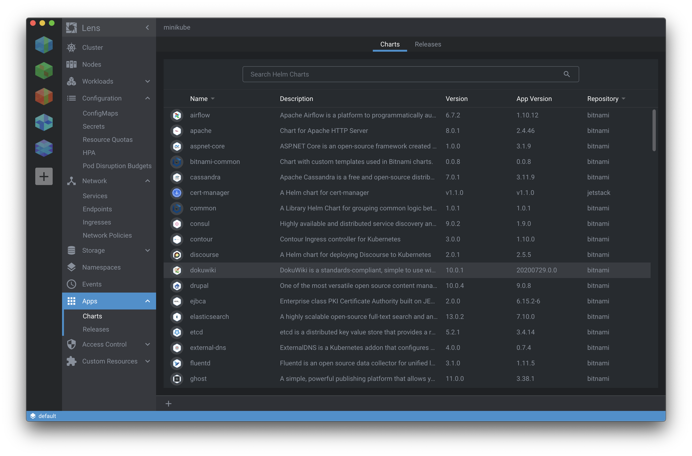

# Using Helm charts

Lens has integration to Helm making it easy to install and manage Helm charts and releases in Apps section.

## Managing Helm reporistories

Used Helm repositories are possible to configure in the [Preferences](/getting-started/preferences). Lens app will fetch available Helm repositories from the Artifact HUB and automatically add `bitnami` repository by default if no other repositories are already configured. If any other repositories are needed to add, those can be added manually via command line. **Note!** Configured Helm repositories are added globally to user's computer, so other processes can see those as well.

## Installing Helm chart

Lens will list all charts from configured Helm repositries on Apps section. To install a chart, you need to select a chart and click "Install" button. Lens will open athe chart in editor where you can select chart version, target namespace and give optionally name for the release and configure values for the release. Finally, by clicking "Install" button Lens will deploy the chart into the cluster.

## Updating Helm release

To update the Helm release, you can open the release details and modify the release values and click "Save" button. To upgrade or downgrade the release, click "Upgrade" button in the release details. In the release editor you can select a new chart version and edit the release values if needed and then click "Upgrade" or "Upgrade and Close" button.

## Deleting Helm release
To delete the existing Helm release open the release details and click trash can icon on the top of the panel. Deletion removes all Kubernetes resources created by the Helm release. **Note!** If the release included any persistent volumes, those are required to remove manually!